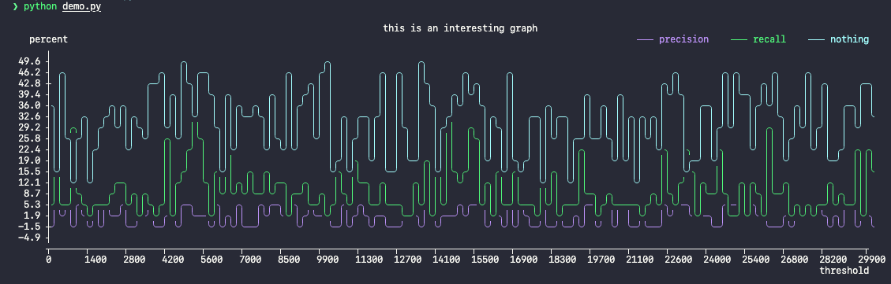

# asciichartpyx

Copy of the Python implementation of [asciichart](https://github.com/kroitor/asciichart) and translation from JS to Python of [this comment](https://github.com/kroitor/asciichart/issues/56#issuecomment-1320508054) to support adding X axis as well as labels and a title

## Example

The following example (also in `demo.py`) cab be run

```python
import asciichartpy as asciichart
from asciichartpyx import plot
import random

myl1 = [random.uniform(-5, 5) for _ in range(300)]
myl2 = [random.expovariate(1/8) for _ in range(300)]
myl3 = [random.uniform(10, 50) for _ in range(300)]
myx = [x * 100 for x in range(len(myl1))]

config = {
    "title": "this is an interesting graph",
    "height": 15,
    "width": 150,
    "colors": [
        asciichart.blue,
        asciichart.green,
        asciichart.lightcyan,
    ],
    "line_labels": [
        "precision",
        "recall",
        "nothing"
    ],
    "x_label": "threshold",
    "y_label": "percent",
    "x_array": myx,
    "format": "{:5.1f}",
}

val = plot([myl1, myl2, myl3], config)
print(val)
```


